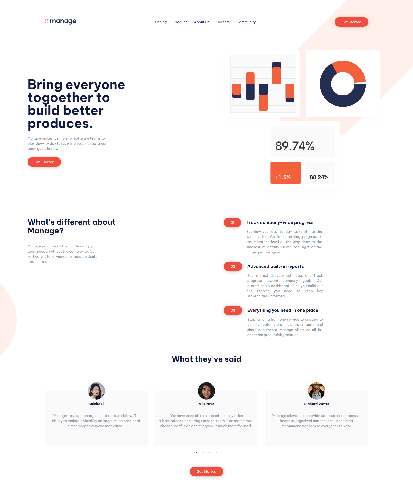
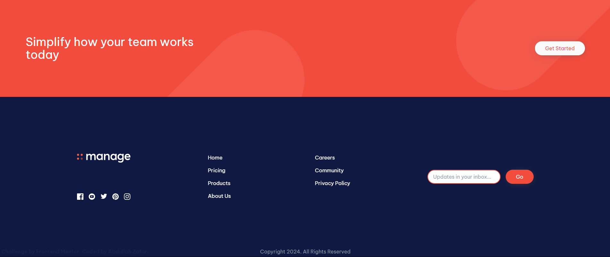
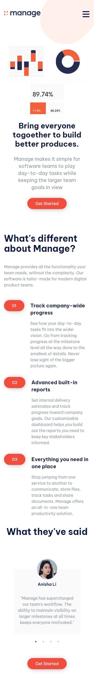
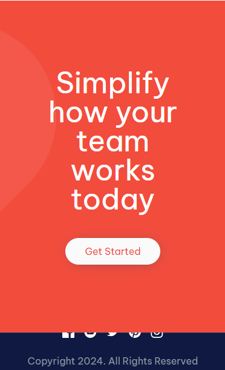
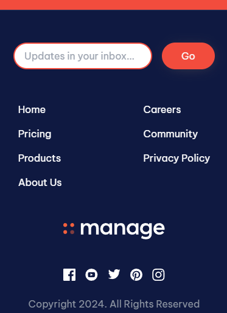

# Frontend Mentor - Manage landing page solution

This is a solution to the [Manage landing page challenge on Frontend Mentor](https://www.frontendmentor.io/challenges/manage-landing-page-SLXqC6P5). Frontend Mentor challenges help you improve your coding skills by building realistic projects.

## Table of contents

- [Overview](#overview)
  - [The challenge](#the-challenge)
  - [Screenshot](#screenshot)
  - [Links](#links)
- [My process](#my-process)
  - [Built with](#built-with)
- [Author](#author)

## Overview

### The challenge

Users should be able to:

- View the optimal layout for the site depending on their device's screen size
- See hover states for all interactive elements on the page
- See all testimonials in a horizontal slider

### Screenshot

#### Desktop

#### Mobile

### Links

- Solution URL: [Solution URL](https://github.com/ei-abdullah/manage-landing-page)
- Live Site URL: [Live site URL](https://your-live-site-url.com)

## My process

### Built with

- [Tailwind CSS](https://tailwindcss.com/) - CSS framework
- [React](https://reactjs.org/) - JS library
- [Framer Motion](https://www.framer.com/motion/) - Animation library

## Author

- LinkedIn - [@eiabdullah](https://www.linkedin.com/in/eiabdullah/)
- GitHub - [@ei-abdullah](https://github.com/ei-abdullah)
- X - [@blocAbdullah](https://x.com/blocAbdullah)
- Frontend Mentor - [@ei-abdullah](https://www.frontendmentor.io/profile/ei-abdullah)
